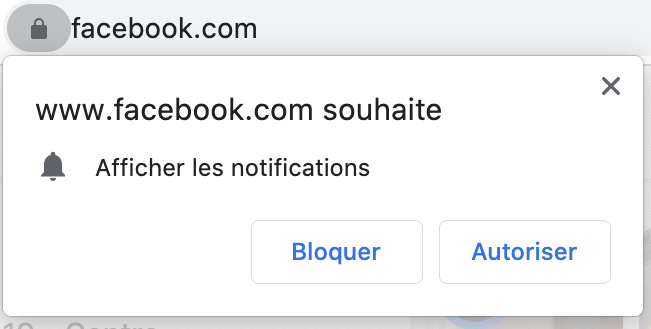

# Facebook_Scraping
 Scraping des données sur Facebook / Comparer la liste d’amis périodiquement / Envoi-de message automatique
---
title: "| Facebook-Scraping : \n| Dites \"\\textit{Ciao!}\" au contact qui vous supprime
  de la liste d'amis  \n"
author: "Lucic A., Moezzibadi, M., Mbengue M."
date: "Mars 2021"


* [Selenium](https://www.selenium.dev)
* [chromedriver](https://chromedriver.storage.googleapis.com/index.html)
* [beautifulsoup](https://pypi.org/project/beautifulsoup4/)
* [geckodriver](https://github.com/mozilla/geckodriver/releases)
* [iedriver](https://github.com/SeleniumHQ/selenium/wiki/InternetExplorerDriver)
* 
Associated with the above are five functions to download/manage the binaries:

* `selenium(...)`
* `chrome(...)`
* `phantomjs(...)`
* `gecko(...)`
* `iedriver(...)`


---

```{r setup, include=FALSE}
library(kableExtra)
library(magrittr) # For the %>% pipe operator
library(reticulate) # For Python
use_python("/Users/moezzibadi/Library/r-miniconda/envs/r-reticulate/bin/python", required=T)
py_install("bs4")
py_install("selenium")
knitr::opts_chunk$set(eval = TRUE)
python.reticulate = FALSE
def.chunk.hook  <- knitr::knit_hooks$get("chunk")
knitr::knit_hooks$set(chunk = function(x, options) {
  x <- def.chunk.hook(x, options)
  ifelse(options$size != "normalsize", paste0("\n \\", options$size,"\n\n", x, "\n\n \\normalsize"), x)
})
```

# Introduction

- **Envie de savoir qui vous a supprimé de ses amis en FB!**

{width=40%}

::: {.block}
### Objectifs :
1) Scraping des données sur Facebook
2) Comparer la liste d'amis périodiquement
3) Envoi-de message automatique 
:::

# Outils de scraping FB


# Pourqoui Selenium?

- Facebook n'est pas un site régulier avec un budget limité
- Un système anti-bot très puissant
- urllib.request => Document HTML incomplet
- Selenium utilise un exécutable (*webdriver*) afin de contrôler *Chrome (Firebox)*
- Une combinaison de Beautiful Soup et Selenium pour le **Scraping dynamique**

::: {.block}
### Importer les modules utilisés dans le but du Scraping 
```{python, echo=TRUE}
import time
from bs4 import BeautifulSoup
from selenium import webdriver
from selenium.webdriver.common.by import By
from selenium.webdriver.support.ui import WebDriverWait
from selenium.webdriver.support import expected_conditions as EC
```
:::


# Plan du code

{width=50%}

# Argparse
:::: {.blackbox data-latex=""}
::: {.center data-latex=""}
**Problème!**
:::

Comment éviter les tâches répétitives de changements manuels des paramètres en début du code?

* Un fichier de configurations
* Le module d'*Argparse* 


::::

*Argparse* (*Optparse* de r) nous permet de:

- créer une interface de ligne de commande 
- définir une aide pour l’appel de chaque argument 
- préciser son objectif et son mode d’usage

# Timer
- 1ère partie : 

1) Faire tourner le code périodiquement: 
```{python, eval=FALSE, size="scriptsize"}
t = time.time()
while True:
  TROUVE_ENVOI(user_id,password) #: La fonction principale 
time.sleep(86400)
```

2) Faire tourner le code à un instant précis:

```{python, eval=FALSE, size="scriptsize"}
from datetime import datetime	
from threading import Timer							
x=datetime.today()											
y=x.replace(day=x.day+1, hour=00, minute=2, second=0, microsecond=0)
delta_t=y-x																											
secs=delta_t.seconds+1
TROUVE_ENVOI(user_id,password) #: La fonction principale     
t = Timer(secs, TROUVE_ENVOI)
t.start()
```

# Argparse
- 2ème partie : Créer une interface de ligne de commande 
```{python, echo=TRUE, size="tiny"}
import argparse,getpass
class Password:
    DEFAULT = 'Prompt if not specified'
    def __init__(self, value):
        if value == self.DEFAULT:
            value = getpass.getpass('LDAP Password: ')
        self.value = value
    def __str__(self):
        return self.value
class PasswordPromptAction(argparse.Action):
    def __call__(self, parser, args, values, option_string=None): # If no value is given on the commandline prompt for password.
        if values:# Ideally a security warning could be generated here.
            setattr(args, self.dest, values)
        else:
            setattr(args, self.dest, getpass.getpass())
parser = argparse.ArgumentParser(formatter_class=argparse.ArgumentDefaultsHelpFormatter)
parser.add_argument('-u', '--username', help='Specify username',
    default=getpass.getuser())
parser.add_argument("-p", "--password", type=str, action=PasswordPromptAction, nargs='?')
args = parser.parse_args()
user_id=args.username
password=args.password
```

# Initialiser les fichiers des contacts
- 3 ème partie : Créer un message pop-up pour initialiser les fichiers 
```{python, eval=FALSE, size="tiny"}
import sys #Question pop up
question="Est-ce que c'est la première fois que vous lancez le code? "
valid=True
def PopUp(question):
    valid = {"oui": True,"non": False}
    while True:
        sys.stdout.write(question)
        choix = input().lower()
        if choix in valid:
            return valid[choix]
        else:
            sys.stdout.write("Veuillez répondre par 'oui' ou par 'non'. ")
valid=PopUp(question) 
```

- Autoriser l'automatisation à distance pour le navigateur

<center> 

{width=27%}

<center>

# 4ème partie : Scraping 


- Désactiver les notifications
<center> 

{width=37%}

<center>

```{python, eval=FALSE, size="scriptsize"}
# Créer une instance de ChromeOptions class :
	options = webdriver.ChromeOptions()
# Ajouter chrome switch pour désactiver la notification :
	options.add_argument('--disable-notifications')
# Passer l'instance de ChromeOptions à ChromeDriver Constructor :
	browser = webdriver.Chrome(ChromeDriverManager().install(), options=options)
```

# 4ème partie : Scraping 

- Se connecter avec les identifiants:

```{python, eval=FALSE, size="scriptsize"}
browser.implicitly_wait(10)
browser.get("https://www.facebook.com")
time.sleep(3)
browser.find_element_by_xpath('//*[@title="Tout accepter"]').click()
WebDriverWait(browser, 5).until(EC.element_to_be_clickable((By.XPATH,'//*[@title="Tout\
... accepter"]'))).click()
element=browser.find_element_by_id("email")
element.send_keys(user_id)
passwor=browser.find_element_by_id("pass")
passwor.send_keys(password)
time.sleep(3)
clicker=browser.find_element_by_xpath('//*[@name="login"]')
clicker.click()
```

\todo{Ça y est! On a réussi à se connecter.}

# Scraping 

- Charger la page de la liste d'amis:

```{python, eval=FALSE, size="scriptsize"}
	time.sleep(3)
	browser.get("https://www.facebook.com/me/friends") 
```

- *execute_script*: Une interface qui permet d'executer les commandes de JavaScript:

```{python, eval=FALSE, size="scriptsize"}
	time.sleep(3)
	##----Défiler vers le bas-------
	while True:
		browser.execute_script('window.scrollTo(0,document.body.scrollHeight);')
		time.sleep(1)
		browser.execute_script('window.scrollTo(0,0);')
		time.sleep(1)
		try:
			exit_command=browser.find_element_by_xpath("//*[contains(text(),'Photos de vous')]")
			break
		except:
			continue
```

# Scraping 
Having a blank slide at the end with the title "References" will put the detailed bibliography at the end.

See [@Robertson1956-wn] for details.

# References
