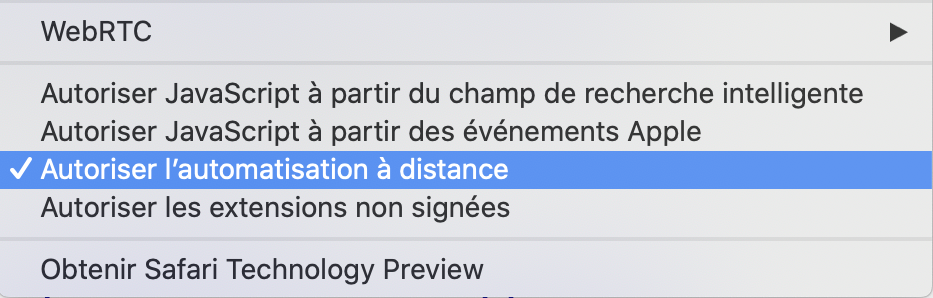
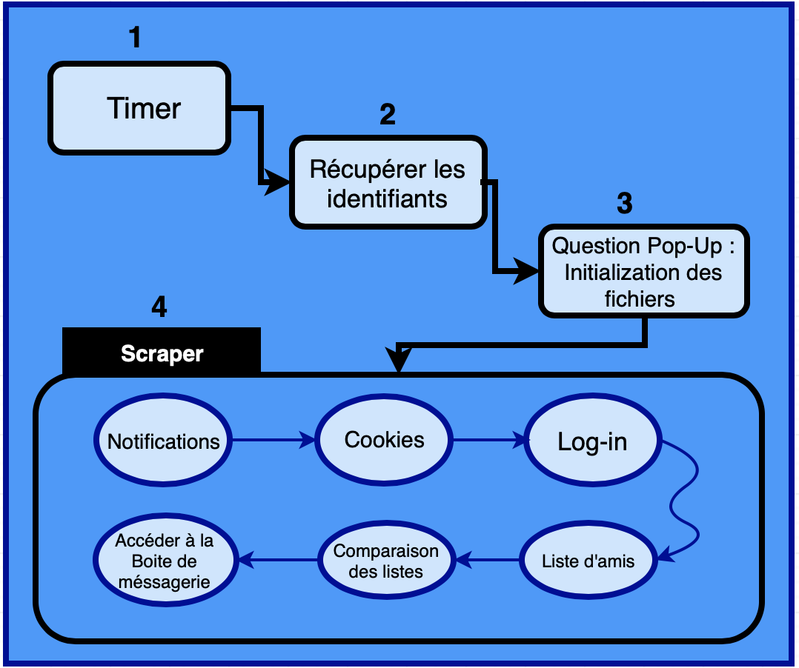

# Facebook_Scraping
 Scraping dynamique
---

Dans le script on utilise deux outils pricipals:
* Selenium automatise l'interaction du navigateur Web à partir de python en utilisant un exécutable (*webdriver*) afin de contrôler *Chrome ou Firefox* (on clic sur les boutons avec Selenium).
* Beautifulsoup récupére l'information d'une balise HTML précise

Liens outils :

* [beautifulsoup](https://pypi.org/project/beautifulsoup4/)
* [Selenium](https://www.selenium.dev)
* [chromedriver](https://chromedriver.storage.googleapis.com/index.html)


## Introduction

* Objectifs :*
1) Scraping des données sur Facebook
2) Comparer la liste d'amis régulièrement
3) Envoie de message automatique 


## Autoriser l’automatisation à distance pour le navigateur 

Avant tous, il faut autoriser l'automatisation à distance pour le navigateur. Google Chrome ou Firefox doit être installé sur votre ordinateur.

<center> 



<center>

## Ligne de commande

Pour faire tourner le code dans le terminal on tape la commande suivante (remplacer *username* par votre identifiant):
```{python, echo=TRUE}
python FB.py -p -u 'username'
```
Ensuite il faut taper votre mot de passe (ça s'affiche pas dans le terminal pour des raisons de sécurité).

## Question Pop-Up
Le code doit créer la liste d'amis et la comparer avec la liste issue de la prochaine execution du code,  si c'est pour la première fois code vous executer le program. Donc il faut répondre "oui" ou "non" à la question qui s'affiche. Si la réponse est "non" le code trouve la personne qui vous a supprimé et lui envoie un méssage de "Ciao mon ami(e), Merci de ne pas répondre à ce message automatique."

## Plan du code



